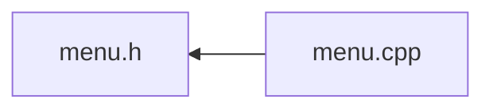

<a id="menu_8h"></a>
# File menu.h

![][C++]

**Location**: `C:/Users/garf/Documents/PlatformIO/Projects/ArduinoMenuSystem/lib/cliSerialMenu/menu.h`

here are the menuSystemOverTty object and it's friends.

This library makes intensive use of object-oriented programming. All the object definitions of menuSystemOverTty base objects to be inherited as customizations. Here are the menuSystemOverTty manager oject, and the base objects which to inherit to create custom menus,


**author**\
Gerard Forcada Bigas


**date**\
17/10/24

## Classes

* [menuOption](classmenu_option.md#classmenu_option)
* [menuOptionOnOff](classmenu_option_on_off.md#classmenu_option_on_off)
* [menuOptionRangeValue](classmenu_option_range_value.md#classmenu_option_range_value)
* [changeScreenMenuOption](classchange_screen_menu_option.md#classchange_screen_menu_option)
* [screenMenu](classscreen_menu.md#classscreen_menu)
* [menu](classmenu.md#classmenu)
* [textBoxMenuOption](classtext_box_menu_option.md#classtext_box_menu_option)
* [menuTextBox](classmenu_text_box.md#classmenu_text_box)

## Includes

* [terminalParser.h](terminal_parser_8h.md#terminal_parser_8h)
* <Arduino.h>


## Included by

* [menu.cpp](menu_8cpp.md#menu_8cpp)





## Macros

<a id="menu_8h_1aecf7b06440356b5a9a90ab2520a596db"></a>
### Macro terminalSizeMaxQueries

![][public]


```cpp
#define terminalSizeMaxQueries 4
```


<a id="menu_8h_1ab5c1e7d4bb061144388db2e422abdbf6"></a>
### Macro \_MENU\_UI\_BIG\_RAM\_

![][public]


```cpp
#define _MENU_UI_BIG_RAM_
```


<a id="menu_8h_1ad0afcf7c19728a83e8055bf451d2010b"></a>
### Macro screenMenuMax

![][public]


```cpp
#define screenMenuMax 6
```


<a id="menu_8h_1ac76587272a788bb7757770f3ced7be23"></a>
### Macro menuTextArrayLength

![][public]


```cpp
#define menuTextArrayLength 80
```


<a id="menu_8h_1a72288823988215a55a00dc40ea61a0b1"></a>
### Macro menuOptionsMax

![][public]


```cpp
#define menuOptionsMax 12
```


<a id="menu_8h_1a17fa68dadf757bd048564eb1b0a79836"></a>
### Macro displayMenuOptionsDefault

![][public]


```cpp
#define displayMenuOptionsDefault 8
```


<a id="menu_8h_1ac703e8b9cfab10feb6bd75e4c9a66956"></a>
### Macro minTextBoxWidth

![][public]


```cpp
#define minTextBoxWidth 4
```


<a id="menu_8h_1aa539a3070300aef5ea0b1661f0a9961b"></a>
### Macro escBackMillisecondsDelay

![][public]


```cpp
#define escBackMillisecondsDelay 450
```


<a id="menu_8h_1a747a09c3da30256f1b70e735b6a7a0e7"></a>
### Macro defaultTextBoxWidth

![][public]


```cpp
#define defaultTextBoxWidth 20
```


<a id="menu_8h_1a4a0fbf9bba11658946fe94d48c205c11"></a>
### Macro menuTextLength

![][public]


```cpp
#define menuTextLength (menuTextArrayLength-1)
```


<a id="menu_8h_1aa0a17a95ab131571df9a625fd74ffe1c"></a>
### Macro queryterminalSizeTimeout

![][public]


```cpp
#define queryterminalSizeTimeout 250UL
```


milliseconds to wait for terminal size report


<a id="menu_8h_1a440b4791067da0672e4b3b049f3c25bb"></a>
### Macro userInputLag

![][public]


```cpp
#define userInputLag 50
```


<a id="menu_8h_1aa9b8dcc02cea15aab8e3d0b7860327a7"></a>
### Macro INPUT\_BUFFER\_SIZE

![][public]


```cpp
#define INPUT_BUFFER_SIZE 320
```


## Enumeration types

<a id="menu_8h_1ac4a84be0bf2a19771281a6659df073f5"></a>
### Enumeration type textBoxStatus

![][public]

**Definition**: `C:/Users/garf/Documents/PlatformIO/Projects/ArduinoMenuSystem/lib/cliSerialMenu/menu.h` (line 51)


```cpp
enum textBoxStatus {
  noExit,
  activeEditor,
  softwareAborted,
  escPressed,
  enterPressed,
  error
}
```


<a id="menu_8h_1ac4a84be0bf2a19771281a6659df073f5a067cb1ac50138b3006b4a90a35581e2a"></a>
#### Enumerator noExit


<a id="menu_8h_1ac4a84be0bf2a19771281a6659df073f5a0bacd4f2fc6563edd729a9170b890a65"></a>
#### Enumerator activeEditor


<a id="menu_8h_1ac4a84be0bf2a19771281a6659df073f5a39af98a0d8fc089bf8679d460da79fda"></a>
#### Enumerator softwareAborted


<a id="menu_8h_1ac4a84be0bf2a19771281a6659df073f5a187cd739335febc5323a214695bd6c92"></a>
#### Enumerator escPressed


<a id="menu_8h_1ac4a84be0bf2a19771281a6659df073f5a28b550b946e85492e3cc701667a888b2"></a>
#### Enumerator enterPressed


<a id="menu_8h_1ac4a84be0bf2a19771281a6659df073f5ad606e435413ea0944dd00d49e901e4ed"></a>
#### Enumerator error


## Variables

<a id="menu_8h_1a7282588b761386055d53ce8134cf9f20"></a>
### Variable msgOptionsUp

![][public]
![][static]

**Definition**: `C:/Users/garf/Documents/PlatformIO/Projects/ArduinoMenuSystem/lib/cliSerialMenu/menu.h` (line 43)


```cpp
const char* msgOptionsUp = " Up!"
```


**Type**: const char *

<a id="menu_8h_1ac5e83d339effff0a95bcd93521f69c90"></a>
### Variable msgOptionsDn

![][public]
![][static]

**Definition**: `C:/Users/garf/Documents/PlatformIO/Projects/ArduinoMenuSystem/lib/cliSerialMenu/menu.h` (line 44)


```cpp
const char* msgOptionsDn = " Dn!"
```


**Type**: const char *

<a id="menu_8h_1a0d552bc0097a7a3da9ac04f0076e3733"></a>
### Variable insertText

![][public]
![][static]

**Definition**: `C:/Users/garf/Documents/PlatformIO/Projects/ArduinoMenuSystem/lib/cliSerialMenu/menu.h` (line 45)


```cpp
const char* insertText = " INSERT"
```


**Type**: const char *

<a id="menu_8h_1a58aa1cbda0d0701af5cd55568509cd68"></a>
### Variable menuSystemOverTty

![][public]

**Definition**: `C:/Users/garf/Documents/PlatformIO/Projects/ArduinoMenuSystem/lib/cliSerialMenu/menu.h` (line 271)


```cpp
menuTextBox menuSystemOverTty
```


**Type**: [menuTextBox](classmenu_text_box.md#classmenu_text_box)

<a id="menu_8h_1a2e8e5a0db1e23bfacce9ac4ad19e69e9"></a>
### Variable menuSystemOverTtyP

![][public]

**Definition**: `C:/Users/garf/Documents/PlatformIO/Projects/ArduinoMenuSystem/lib/cliSerialMenu/menu.h` (line 272)


```cpp
menuTextBox* menuSystemOverTtyP
```


**Type**: [menuTextBox](classmenu_text_box.md#classmenu_text_box) *

## Source


```cpp

#ifndef __menu__
#define __menu__
#include "terminalParser.h"
#include <Arduino.h>
#define terminalSizeMaxQueries 4
//---------------------RESOURCES USAGE HERE
//---------------------Uncomment the following line for microcontrollers bigger than Atmega328P line RP2040 or ESP32
#define _MENU_UI_BIG_RAM_

//---------------------RESOURCES USAGE HERE
#ifdef _MENU_UI_BIG_RAM_
  #define screenMenuMax 6// maximum screenMenu instances, displays
  #define menuTextArrayLength 80 // Max caption length 
  #define menuOptionsMax 12 // maximum menu options allowed in memory for each screenMenu instance
  #define displayMenuOptionsDefault 8 // the amount of menu options on the screen, always lower than screenMenuMax
  #define minTextBoxWidth 4
  #else
  #define screenMenuMax 4// maximum screenMenu instances, displays of menuitems
  #define menuTextArrayLength 40 // Max caption length 
  #define menuOptionsMax 7 // maximum menu options allowed in memory for each screenMenu instance
  #define displayMenuOptionsDefault 4 // the amount of menu options on the screen, always lower than screenMenuMax
  #endif
  
  
#define escBackMillisecondsDelay 450 // wait until esc is known as 'wants to go back'
#define defaultTextBoxWidth 20
#define menuTextLength (menuTextArrayLength-1)

#define queryterminalSizeTimeout 250UL 

static const char * msgOptionsUp = " Up!";
static const char * msgOptionsDn = " Dn!";
static const char * insertText = " INSERT";

class menuTextBox;
class screenMenu;
class menu;

enum textBoxStatus {
  noExit,
  activeEditor,
  softwareAborted,
  escPressed,
  enterPressed,
  error
}; 

class menuOption{
  public:
    menuOption();
    menuOption(const char* text);
    char text[menuTextArrayLength];
    virtual void run();
    virtual bool refresh();
    virtual bool pushRt();
    virtual bool pushLt();
    bool autoRefresh = true;
};
class menuOptionOnOff :public menuOption{
  public:
    bool state,statePrinted;
    menuOptionOnOff();
    menuOptionOnOff(const char* text,bool initValue=false);
    virtual bool refresh() override;
    virtual bool pushRt() override;
    virtual bool pushLt() override;
};
class menuOptionRangeValue :public menuOption{
  public:
    int state,statePrinted,_maxValue,_minValue,_step;
    menuOptionRangeValue();
    menuOptionRangeValue(const char* text, int minVal, int maxVal, int initValue, int step=1);
    virtual bool refresh() override;
    virtual bool pushRt() override;
    virtual bool pushLt() override;
};
class changeScreenMenuOption : public menuOption{
    public:
        screenMenu* _menuDesti;
        changeScreenMenuOption(screenMenu* menuDesti);
        void run() override;
        bool refresh() override;
};
class screenMenu{
  protected:
  public: 
    int whereICame; 
    bool autoRefresh = false;
    bool hasMoreAbove = false;
    bool hasMoreBelow = false;
    unsigned int totalMenuOptions;
    unsigned int offsetFromTop =0;
    unsigned int lastSelectedMenuOptionIndex = 0;
    char titol[menuTextArrayLength];
    menuOption *displayMenuOptionsPnt[menuOptionsMax];
    screenMenu(const char* text);
    virtual void setHasMores();
    virtual bool pushUp();
    virtual bool pushDn();
    virtual bool pushRt(unsigned int index);
    virtual bool pushLt(unsigned int index);
    virtual bool addMenuOption(menuOption* menuoption);
    virtual bool refreshMenu();
    virtual void run(unsigned int index);
    virtual void leave();
    virtual void enter();
};
class menu : public terminalParser{
  protected:
    static constexpr char frameChars[3] = {'-','|','+'};//horizontal, vertical, corner
    unsigned int selectedMenuOption;
    unsigned long nextRefresh = 0;
    bool runningOption = false;
    unsigned int contentOriginRow = 1;
    unsigned int contentOriginCol = 1;
    void show(unsigned int index);
    virtual void cUU(unsigned int argc,int *argv) override;
    virtual void cUD(unsigned int argc,int *argv) override;
    virtual void cUF(unsigned int argc,int *argv) override;
    virtual void cUB(unsigned int argc,int *argv) override;
    virtual void cPR(unsigned int argc,int *argv) override;
    virtual void cr() override;
    void queryTerminalSize(bool wait4Response=true);
    char lastInputChar;
    unsigned long nextEscBack = 0;
  public:
    uint8_t _topPadding = 1;
    bool askTerminalSize = true;
    bool verticallyCenter = false;
    bool horizontallyCenter = true;
    unsigned int terminalRowsCols[2] = {0, 0};
    uint8_t terminalSizeQueries = 0;
    int activeScreenMenu = -1;
    int totalScreenMenus = 0;
    unsigned int screenMenuOptions = displayMenuOptionsDefault;
    screenMenu *pantalles[screenMenuMax];
    //------set up and initialization
    menu();
    virtual void init(Stream *userSerialTerminal) override;
    void addscreen(screenMenu* pantalla);
    //---------loop code
    void run();
    //----------user interaction functions
    bool msgTxtInput(const char* prompt,char* result, unsigned int maxLength, unsigned int minLength=0);
    void msgSmallWait(const char* prompt);
    void msgPause(const char* prompt);
    bool msgYes(const char* prompt);
    void msgPause();
    //----------style print operations
    void setPrettyDotLeadersMargin(int bothTextsLength);
    void printLnCentered(const char* text);
    void printLnCentered(const String &text);
    void printLnCentered();
    void printLnCentered(char c);
    void printLnCentered(unsigned char b, int base = DEC);
    void printLnCentered(int num, int base = DEC);
    void printLnCentered(unsigned int num, int base = DEC);
    void printLnCentered(long num, int base = DEC);
    void printLnCentered(unsigned long num, int base = DEC);
    void printLnCentered(long long num, int base = DEC);
    void printLnCentered(unsigned long long num, int base = DEC);
    void printLnCentered(double num, int digits = 2);
    
    uint8_t dotLeadersMargin = 2;
    uint8_t dotLeadersMinDots = 2;
    char dotLeadersChar = '.';
    unsigned int dotLeadersDefaultWidth = menuTextArrayLength;
    unsigned int printDotLeaders(const char* left, const char* right, int margin = -1, int minDots = -1);
    //---------not so used, rarely for public use
    void setscreen(int targetScreenMenu, bool setWhereICame = true);
    void refresh();
    void doBack();
    void show();
};

#ifdef _MENU_UI_BIG_RAM_
#define userInputLag 50
#define INPUT_BUFFER_SIZE 320

class textBoxMenuOption:public menuOption{
protected:
public:
    String caption;
    textBoxMenuOption();
    textBoxMenuOption( const char* text);
    virtual void run() override;
    virtual bool checkBackgroundEvents();
    virtual bool performUserInteraction();
};

class menuTextBox:public  menu{
  private:
    bool lastInsertStatus;
    char* _result = nullptr; // ownership: class allocates/frees
    unsigned int _maxStrLen = 0;
    unsigned int cursorBufferIndex = 0;
    unsigned long lastUserInputTime = 0;
    void drawTextPreCursor();
    void drawTextPostCursor(unsigned int fromLineToEnd);
    void redrawLine(unsigned int line);
    void cleanupEditor();
    void removeCharAtIndex(unsigned int index);
    void manageCaretAndSpace(bool erase = false);
    unsigned int getCursorRowIndex();
    unsigned int getTotalLinesCapacity();
    unsigned int getWrittenLinesCount();
    unsigned int getCursorColIndex();
    unsigned int getCaptionLinesCount();
    unsigned int drawnFrameHeight;
    void redrawFrame();
    void drawFrame(bool erase = false);
    void statusBar();
    void eraseStatusBar();
    //---------- redirigeixen a terminalParser
    void cUB(unsigned int argc,int *argv) override;
    void cUF(unsigned int argc,int *argv) override;
    void cUU(unsigned int argc,int *argv) override;
    void cUD(unsigned int argc,int *argv) override;
    void del() override;
    void lf() override;
    void backSpace() override;
    void start() override;// to-do posar a menu::
    void end() override;// to-do posar a menu::
    void cr() override;
  public:
    static const char* exitCodeDescription[];
    uint16_t textLineWidth = defaultTextBoxWidth;
    uint8_t lastTextBoxExitCode =0;
    menuTextBox();
    ~menuTextBox(); // ensur e cleanup of dynamic buffer
    textBoxStatus _textBoxStatus = textBoxStatus::noExit;
    textBoxMenuOption* _textBoxCallBack = nullptr;
    void msgTxtInputMultiline(char* result, unsigned int maxLength, unsigned int minLength=0,const char * allowedChars = nullptr);
};
extern menuTextBox menuSystemOverTty;
extern menuTextBox * menuSystemOverTtyP;

#else
extern menu menuSystemOverTty;
extern menu * menuSystemOverTtyP;
#endif

#endif
```


[public]: https://img.shields.io/badge/-public-brightgreen (public)
[C++]: https://img.shields.io/badge/language-C%2B%2B-blue (C++)
[private]: https://img.shields.io/badge/-private-red (private)
[static]: https://img.shields.io/badge/-static-lightgrey (static)
[protected]: https://img.shields.io/badge/-protected-yellow (protected)