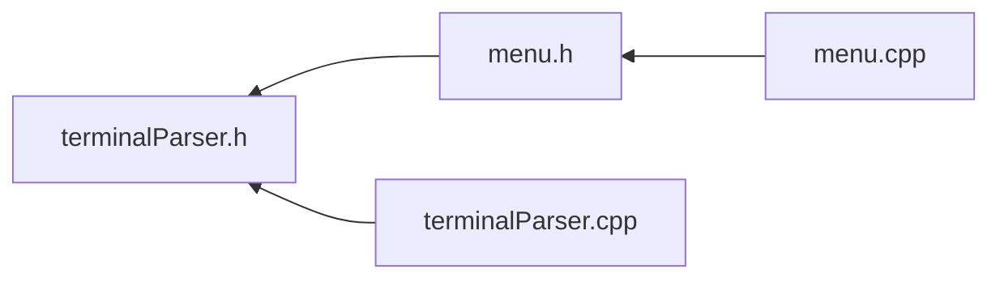

<a id="terminal_parser_8h"></a>
# File terminalParser.h

![][C++]

**Location**: `C:/Users/garf/Documents/PlatformIO/Projects/ArduinoMenuSystem/lib/cliSerialMenu/terminalParser.h`

object and resources definitions for terminal parser library, Inheritable byte-by-byte string parser state machine.

This library makes intensive use of object-oriented programming. Meant to be inherited to make use of it's features.


**author**\
Gerard Forcada Bigas


**date**\
20/12/22

## Classes

* [terminalParser](classterminal_parser.md#classterminal_parser)

## Includes

* <Arduino.h>


## Included by

* [menu.h](menu_8h.md#menu_8h)
* [terminalParser.cpp](terminal_parser_8cpp.md#terminal_parser_8cpp)





## Macros

<a id="terminal_parser_8h_1a1a4e083d4a507b9eb10db3a81a8b4731"></a>
### Macro terminalParser\_bufferSize

![][public]


```cpp
#define terminalParser_bufferSize 10
```


<a id="terminal_parser_8h_1aab3d89da9155d7feca19c408b9b69114"></a>
### Macro inverteixColorsTerminal

![][public]


```cpp
#define inverteixColorsTerminal "\e[7m"
```


<a id="terminal_parser_8h_1aa19473ab24e6cf57100494740d614e6c"></a>
### Macro colorsTerminalReset

![][public]


```cpp
#define colorsTerminalReset "\e[m"
```


## Enumeration types

<a id="terminal_parser_8h_1a58a5e757f9c902f7fc41cd9965723882"></a>
### Enumeration type CONTROL\_CARACTERS

![][public]

**Definition**: `C:/Users/garf/Documents/PlatformIO/Projects/ArduinoMenuSystem/lib/cliSerialMenu/terminalParser.h` (line 22)


```cpp
enum CONTROL_CARACTERS {
  BEEP = 0x07,
  BACKSPACE = 0x08,
  HT = 0x09,
  LF = 0x0A,
  CR = 0x0D,
  SO = 0x0E,
  SI = 0x0F,
  CAN = 0x18,
  ESC = 0x1B,
  DEL = 0x7F,
  CSI = 0x9B
}
```


1 keystroke keys


<a id="terminal_parser_8h_1a58a5e757f9c902f7fc41cd9965723882a55c335030e8a8ca836ef2f944e44355b"></a>
#### Enumerator BEEP


<a id="terminal_parser_8h_1a58a5e757f9c902f7fc41cd9965723882ad2534cebcf6f430484b7c931dd657ddc"></a>
#### Enumerator BACKSPACE


<a id="terminal_parser_8h_1a58a5e757f9c902f7fc41cd9965723882abefe71f421bd5c2c92fcb8c38e21445d"></a>
#### Enumerator HT


<a id="terminal_parser_8h_1a58a5e757f9c902f7fc41cd9965723882a6882283dac181897b0f08bb545c6e1e4"></a>
#### Enumerator LF


<a id="terminal_parser_8h_1a58a5e757f9c902f7fc41cd9965723882aaaa8401b50cb34e3a0d58729f70494f0"></a>
#### Enumerator CR


<a id="terminal_parser_8h_1a58a5e757f9c902f7fc41cd9965723882af9f590fe6d84e72c832e714b75b1604b"></a>
#### Enumerator SO


<a id="terminal_parser_8h_1a58a5e757f9c902f7fc41cd9965723882a6cbe5ff42f143903e1c67abf94613791"></a>
#### Enumerator SI


<a id="terminal_parser_8h_1a58a5e757f9c902f7fc41cd9965723882a1ecfa0998855a0963b5d298332dbd22c"></a>
#### Enumerator CAN


<a id="terminal_parser_8h_1a58a5e757f9c902f7fc41cd9965723882af5297152557c7da396243000ca240e89"></a>
#### Enumerator ESC


<a id="terminal_parser_8h_1a58a5e757f9c902f7fc41cd9965723882a11563127ec3be864b514a1784c5d37a6"></a>
#### Enumerator DEL


<a id="terminal_parser_8h_1a58a5e757f9c902f7fc41cd9965723882a08c8a203b34102af48189ba3baad19da"></a>
#### Enumerator CSI


<a id="terminal_parser_8h_1aff396320953c99edabf026551521a982"></a>
### Enumeration type ESCAPE\_SEQUENCES

![][public]

**Definition**: `C:/Users/garf/Documents/PlatformIO/Projects/ArduinoMenuSystem/lib/cliSerialMenu/terminalParser.h` (line 39)


```cpp
enum ESCAPE_SEQUENCES {
  RIS = 'c',
  IND = 'D',
  NEL = 'E',
  HTS = 'H',
  RI = 'M',
  DECID = 'Z',
  DECSC = '7',
  DECRC = '8',
  ES_CSI = '[',
  DECPNM = '>',
  DECPAM = '=',
  OSC = ']',
  selecting_character_set = '%',
  DECALN = '#',
  STARTG0 = '(',
  STARTG1 = ')'
}
```


which kind of escape are we going to?


<a id="terminal_parser_8h_1aff396320953c99edabf026551521a982a62a1c93abe33925b7445cead48b62c3c"></a>
#### Enumerator RIS


<a id="terminal_parser_8h_1aff396320953c99edabf026551521a982ae0f957655606c4f0a0f8b4b640c9db3b"></a>
#### Enumerator IND


<a id="terminal_parser_8h_1aff396320953c99edabf026551521a982ad1316eacd5e971ac5a41a36f25149c82"></a>
#### Enumerator NEL


<a id="terminal_parser_8h_1aff396320953c99edabf026551521a982ab9ec891ec352cc4e920f096633db2c9b"></a>
#### Enumerator HTS


<a id="terminal_parser_8h_1aff396320953c99edabf026551521a982a099d068a32ba44f4df4162679897f9ab"></a>
#### Enumerator RI


<a id="terminal_parser_8h_1aff396320953c99edabf026551521a982a58a56a90387b303ee26ad6905836e6b9"></a>
#### Enumerator DECID


<a id="terminal_parser_8h_1aff396320953c99edabf026551521a982a07855e760ffdbf71698910b0199b15dc"></a>
#### Enumerator DECSC


<a id="terminal_parser_8h_1aff396320953c99edabf026551521a982adc0f69b0a3a788b7a118066b55ac8265"></a>
#### Enumerator DECRC


<a id="terminal_parser_8h_1aff396320953c99edabf026551521a982a8d880f95bbc1f1fc1ff5034c3b7ecaec"></a>
#### Enumerator ES\_CSI


<a id="terminal_parser_8h_1aff396320953c99edabf026551521a982aafe4a550ad4d33033532d045a05eda4a"></a>
#### Enumerator DECPNM


<a id="terminal_parser_8h_1aff396320953c99edabf026551521a982a750857e0f0f0dae02c0901bfe8b9eaf3"></a>
#### Enumerator DECPAM


<a id="terminal_parser_8h_1aff396320953c99edabf026551521a982ab12413a339183f28211fdb79c441539d"></a>
#### Enumerator OSC


<a id="terminal_parser_8h_1aff396320953c99edabf026551521a982a3c8e0a05b19b81f65c14899938da5c26"></a>
#### Enumerator selecting\_character\_set


<a id="terminal_parser_8h_1aff396320953c99edabf026551521a982a018c14b553466b1fc83597e81273130d"></a>
#### Enumerator DECALN


<a id="terminal_parser_8h_1aff396320953c99edabf026551521a982a93d7b08dd1e496bcff1f6f18ac53b7a0"></a>
#### Enumerator STARTG0


<a id="terminal_parser_8h_1aff396320953c99edabf026551521a982a61b2db4512e715a0f27fadd8d8e06246"></a>
#### Enumerator STARTG1


<a id="terminal_parser_8h_1ae48ba699dd4e79c566507a6843ae881b"></a>
### Enumeration type CSI\_SEQUENCES

![][public]

**Definition**: `C:/Users/garf/Documents/PlatformIO/Projects/ArduinoMenuSystem/lib/cliSerialMenu/terminalParser.h` (line 61)


```cpp
enum CSI_SEQUENCES {
  ICH = '@',
  CUU = 'A',
  CUD = 'B',
  CUF = 'C',
  CUB = 'D',
  CNL = 'E',
  CPL = 'F',
  CHA = 'G',
  CUP = 'H',
  ED = 'J',
  EL = 'K',
  IL = 'L',
  DL = 'M',
  DCH = 'P',
  ECH = 'X',
  HPR = 'a',
  DA = 'c',
  VPA = 'd',
  VPR = 'e',
  HVP = 'f',
  TBC = 'g',
  SM = 'h',
  RM = 'l',
  SGR = 'm',
  DSR = 'n',
  CPR = 'R',
  DECLL = 'q',
  DECSTBM = 'r',
  Save_cursor_location = 's',
  Restore_cursor_location = 'u',
  HPA = '`',
  LINUX_PRIVATE_CONTROL = ']',
  PRIVATE_CONTROL_SEQUENCE = '?'
}
```


finalization escape sequence command


<a id="terminal_parser_8h_1ae48ba699dd4e79c566507a6843ae881ba2e6aa4dd7be2a2363057d2b1244579b9"></a>
#### Enumerator ICH


<a id="terminal_parser_8h_1ae48ba699dd4e79c566507a6843ae881baa4937b43a6a5ae98a0380a07fd65efe1"></a>
#### Enumerator CUU


<a id="terminal_parser_8h_1ae48ba699dd4e79c566507a6843ae881ba566720baa7d04a9c08da1c51890e4c57"></a>
#### Enumerator CUD


<a id="terminal_parser_8h_1ae48ba699dd4e79c566507a6843ae881ba60d25e9837b502b3e8dfd002ba1d996e"></a>
#### Enumerator CUF


<a id="terminal_parser_8h_1ae48ba699dd4e79c566507a6843ae881baea9eb98d6bb25b6fbfeee7eb08f982cc"></a>
#### Enumerator CUB


<a id="terminal_parser_8h_1ae48ba699dd4e79c566507a6843ae881bafd0b89ab5c7b08831a232ab0b0b66cca"></a>
#### Enumerator CNL


<a id="terminal_parser_8h_1ae48ba699dd4e79c566507a6843ae881ba5745b866be7660ed5938ceab99b887f4"></a>
#### Enumerator CPL


<a id="terminal_parser_8h_1ae48ba699dd4e79c566507a6843ae881bab353f47c825319068bf2850c1ac21adc"></a>
#### Enumerator CHA


<a id="terminal_parser_8h_1ae48ba699dd4e79c566507a6843ae881bac58ac9a3c9c19bad70b2863694fb3574"></a>
#### Enumerator CUP


<a id="terminal_parser_8h_1ae48ba699dd4e79c566507a6843ae881bab72a4284c139f12ff0aa1f63fc7d0167"></a>
#### Enumerator ED


<a id="terminal_parser_8h_1ae48ba699dd4e79c566507a6843ae881ba46283b5b5433d49f2218ac045d358ef6"></a>
#### Enumerator EL


<a id="terminal_parser_8h_1ae48ba699dd4e79c566507a6843ae881baa4c436132f18c991292ad07fe2fbbd46"></a>
#### Enumerator IL


<a id="terminal_parser_8h_1ae48ba699dd4e79c566507a6843ae881ba4e833cccfa9ee34732424662a9b3513e"></a>
#### Enumerator DL


<a id="terminal_parser_8h_1ae48ba699dd4e79c566507a6843ae881bad23bd40c8c00b2347a0a4d50ac7bf578"></a>
#### Enumerator DCH


<a id="terminal_parser_8h_1ae48ba699dd4e79c566507a6843ae881ba7c4573539c32baa990f29b414718641e"></a>
#### Enumerator ECH


<a id="terminal_parser_8h_1ae48ba699dd4e79c566507a6843ae881ba64c1d36b06b8b845cd4d27148622006e"></a>
#### Enumerator HPR


<a id="terminal_parser_8h_1ae48ba699dd4e79c566507a6843ae881ba8544ff9563aa1ab884ba6bf67987c680"></a>
#### Enumerator DA


<a id="terminal_parser_8h_1ae48ba699dd4e79c566507a6843ae881bac88480bd540b6f132623db854c8b5b00"></a>
#### Enumerator VPA


<a id="terminal_parser_8h_1ae48ba699dd4e79c566507a6843ae881ba9b09527fb30701dc59590ff3e74705e9"></a>
#### Enumerator VPR


<a id="terminal_parser_8h_1ae48ba699dd4e79c566507a6843ae881bab671c57e53c5f16faa9397d4931c061a"></a>
#### Enumerator HVP


<a id="terminal_parser_8h_1ae48ba699dd4e79c566507a6843ae881bab6434cc2201dad3b53ed64e25e0a7dae"></a>
#### Enumerator TBC


<a id="terminal_parser_8h_1ae48ba699dd4e79c566507a6843ae881baa65db4fc8f5048ed5dc1711cc9904dfa"></a>
#### Enumerator SM


<a id="terminal_parser_8h_1ae48ba699dd4e79c566507a6843ae881baadfe9f15df0e504945ebdf5d90921231"></a>
#### Enumerator RM


<a id="terminal_parser_8h_1ae48ba699dd4e79c566507a6843ae881bab6deb2d0442bf54a26134530043ca24a"></a>
#### Enumerator SGR


<a id="terminal_parser_8h_1ae48ba699dd4e79c566507a6843ae881ba834373fef208179abf5b13d8dcea2ce0"></a>
#### Enumerator DSR


<a id="terminal_parser_8h_1ae48ba699dd4e79c566507a6843ae881ba6481c413cd446139a8078b64e123f2bb"></a>
#### Enumerator CPR


<a id="terminal_parser_8h_1ae48ba699dd4e79c566507a6843ae881ba495ce4d9b422d700e27eac56ad9df785"></a>
#### Enumerator DECLL


<a id="terminal_parser_8h_1ae48ba699dd4e79c566507a6843ae881ba2517d4323d8778998527f058e199a903"></a>
#### Enumerator DECSTBM


<a id="terminal_parser_8h_1ae48ba699dd4e79c566507a6843ae881ba23996ea5f81e143a6acf746f1e1b5b42"></a>
#### Enumerator Save\_cursor\_location


<a id="terminal_parser_8h_1ae48ba699dd4e79c566507a6843ae881ba18b5046332397bb95c3e982382a0666d"></a>
#### Enumerator Restore\_cursor\_location


<a id="terminal_parser_8h_1ae48ba699dd4e79c566507a6843ae881bae07d6ed36ec4ed2c184747d92780b315"></a>
#### Enumerator HPA


<a id="terminal_parser_8h_1ae48ba699dd4e79c566507a6843ae881bace97ebe9d2cedf34540846737db1ccd5"></a>
#### Enumerator LINUX\_PRIVATE\_CONTROL


<a id="terminal_parser_8h_1ae48ba699dd4e79c566507a6843ae881bac1181a79f5f329101016265f72699dc2"></a>
#### Enumerator PRIVATE\_CONTROL\_SEQUENCE


## Source


```cpp


#ifndef __terminalParser__
#define __terminalParser__
#include <Arduino.h>
#define terminalParser_bufferSize 10
#define inverteixColorsTerminal "\e[7m"
#define colorsTerminalReset "\e[m"
enum CONTROL_CARACTERS
{
    BEEP = 0x07,
    BACKSPACE = 0x08,
    HT = 0x09,
    LF = 0x0A,
    CR = 0x0D,
    SO = 0x0E,
    SI = 0x0F,
    CAN = 0x18,
    ESC = 0x1B,
    DEL = 0x7F,
    CSI = 0x9B
};
enum ESCAPE_SEQUENCES
{
    RIS = 'c',
    IND = 'D',
    NEL = 'E',
    HTS = 'H',
    RI = 'M',
    DECID = 'Z',
    DECSC = '7',
    DECRC = '8',
    ES_CSI = '[',
    DECPNM = '>',
    DECPAM = '=',
    OSC = ']', // COMANDA s.o.
    selecting_character_set = '%', //<-- ignora 1 de més
    DECALN = '#', //<-- ignora 1 de més
    STARTG0 = '(', //<-- ignora 1 de més
    STARTG1 = ')', //<-- ignora 1 de més
};
enum CSI_SEQUENCES
{
    ICH = '@', //Insert the indicated # of blank characters.
    
    CUU = 'A', //Move cursor up the indicated # of rows.
    CUD = 'B', //Move cursor down the indicated # of rows.
    CUF = 'C', //Move cursor right the indicated # of columns.
    CUB = 'D', //Move cursor left the indicated # of columns.

    CNL = 'E', //Move cursor down the indicated # of rows, to column 1
    CPL = 'F', //Move cursor up the indicated # of rows, to column                     1.
    CHA = 'G', // Move cursor to indicated column in current row.
    CUP = 'H', //Move cursor to the indicated row, column (origin at 1,1).
    ED = 'J', //  ESC [ 1 J: erase from start to cursor.ESC [ 2 J: erase whole display.ESC [ 3 J: erase whole display including scroll- && [J clears the part of the screen from the cursor to the end of the screen.
    EL = 'K', //ESC [ 1 K: erase from start of line to cursor. ESC [ 2 K: erase whole line.
    IL = 'L',//Insert the indicated # of blank lines, 
    DL = 'M', //Delete  the indicated # of blank lines
    DCH = 'P', // Delete the indicated # of characters on current                     line
    ECH = 'X', // Erase the indicated # of characters on current                     line
    HPR = 'a', //Move cursor right the indicated # of columns, horizontal position relative
    DA = 'c', //Answer ESC [ ? 6 c: "I am a VT102"
    VPA = 'd', //Move cursor to the indicated row, current column.
    VPR = 'e', // Move cursor down the indicated # of rows. vertical position relative
    HVP = 'f', // Move cursor to the indicated row, column.
    TBC = 'g', //Without parameter: clear tab stop at current                     position.ESC [ 3 g: delete all tab stops.
    SM = 'h', //Set Mode (see below).
    /*the Reset Mode sequences are obtained by replacing the final 'h' by 'l'.*/
    RM = 'l', //Reset Mode, 
    SGR = 'm', //Set attributes
    DSR = 'n', // Status report 
    CPR = 'R', // Status report 
    DECLL = 'q', //Set keyboard LEDs.                     ESC [ 0 q: clear all LEDs                     ESC [ 1 q: set Scroll Lock LED                     ESC [ 2 q: set Num Lock LED                     ESC [ 3 q: set Caps Lock LED
    DECSTBM = 'r', //Set scrolling region; parameters are top and bottom                     row.
    Save_cursor_location = 's',
    Restore_cursor_location = 'u',
    HPA = '`', // Move cursor to indicated column in current row.
    LINUX_PRIVATE_CONTROL = ']', //Linux Console Private CSI Sequences
    PRIVATE_CONTROL_SEQUENCE = '?' //Linux Console Private CSI Sequences
};
class terminalParser  {
    private:
        void _printa(char caracter);
        bool _inControlCaracters(char caracter);
        bool _inEscapeSequences(char caracter);
        bool _inCsiSequences(char caracter);
        unsigned int i;
        void _parsejaUnNumero(bool surt = true);
        void _afegeixCaracterNumero(char caracter);// funcions internes
        void _enterCSI();
        void _surt();
        static const unsigned char CSI_SEQUENCE_LIST[];
        static const unsigned char CONTROL_CARACTER_LIST[];
        static const unsigned char ESCAPE_SEQUENCE_LIST[];
        unsigned int indexllistaNumeros;
        unsigned int indexCaractersNumeros;
        unsigned int indexBuffer;
        bool controlSequence;
        bool esc;
        bool privateControlSequence;
        char _buffer[terminalParser_bufferSize];// per poder fer forwarding i anàlisi bugs
        char caractersNumeros[4];
        int llistaNumeros[4];
        int ignore;
    public:
        bool insertStatus;
        //----------------do console display operations----
        virtual void doClearScreen();
        virtual void doMoveCursor(int line,int column);
        virtual void doCUU(unsigned int amount=1);
        virtual void doCUD(unsigned int amount=1);
        virtual void doCUF(unsigned int amount=1);
        virtual void doCUB(unsigned int amount=1);
        virtual void doEL(bool wholeLine = true);
        virtual void doHideCursor(bool hide = true);
        //----------------string manipulation operations----
        void invertColors(char* entrada,unsigned int allargadaMax);
        void invertColors(String *cadena);
        //--------------public control--------
        virtual void init(Stream *pantalla);
        //virtual void askDisplaySize();/**< cursor position report*/

        Stream *userTty;

        terminalParser();
        bool doGuess(char caracter);
//-----------------------------------crides internes a heretar--------------------------------
        virtual void tab();
        virtual void lf();
        virtual void cr();
        virtual void backSpace();
        virtual void beep();
        
        virtual void del();
        virtual void insert(bool setDisplayInsert=false);
        virtual void start();
        virtual void end();
        virtual void avPg();
        virtual void rePg();
        //to-do pg up pg dn
        virtual void cHA(unsigned int argc,int *argv); 
        virtual void cUU(unsigned int argc,int *argv);
        virtual void cUD(unsigned int argc,int *argv);
        virtual void cUF(unsigned int argc,int *argv);
        virtual void cUB(unsigned int argc,int *argv);
        virtual void eL(unsigned int argc,int *argv);
        virtual void sGR(unsigned int argc,int *argv);
        virtual void dSR(unsigned int argc,int *argv);
        virtual void rM(unsigned int argc,int *argv);
        virtual void sM(unsigned int argc,int *argv);
        virtual void dA(unsigned int argc,int *argv);
        virtual void cUP(unsigned int argc,int *argv);
        virtual void eD(unsigned int argc,int *argv);
        virtual void vPA(unsigned int argc,int *argv);
        virtual void dCH(unsigned int argc,int *argv);
        virtual void cPR(unsigned int argc,int *argv);
};

#endif
```


[public]: https://img.shields.io/badge/-public-brightgreen (public)
[C++]: https://img.shields.io/badge/language-C%2B%2B-blue (C++)
[private]: https://img.shields.io/badge/-private-red (private)
[static]: https://img.shields.io/badge/-static-lightgrey (static)
[protected]: https://img.shields.io/badge/-protected-yellow (protected)