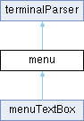

# menu Class Reference {#_classmenu}

menu

`#include <menu.h>`

Inheritance diagram for menu:

{width="50%"}

## Public Member Functions {.unnumbered}

-   [menu](#_classmenu_1ad345b60b72c4992525cf064d5642c1d9) ()

-   virtual void [init](#_classmenu_1aeef76dfa13483e5ad3834befee1a9b1e)
    (Stream \*userSerialTerminal) override

-   void [addscreen](#_classmenu_1a70e706129d30d2cab9f2c1ca145b8911)
    ([screenMenu](#_classscreen_menu) \*pantalla)

-   void [run](#_classmenu_1a5c752d626f8bd8e3ff69ec04b18fc1b1) ()

    Parses the userTty, check user interaction or display query.

-   bool [msgTxtInput](#_classmenu_1a37db65afc7cb697e85eb3e78e2c94367)
    (const char \*prompt, char \*result, unsigned int maxLength,
    unsigned int minLength=0)

-   void [msgSmallWait](#_classmenu_1a6d1b2c9042ea98d42859208ad20312ed)
    (const char \*prompt)

-   void [msgPause](#_classmenu_1aef231381a7322e8822ef9e7ebdbc26a0)
    (const char \*prompt)

-   bool [msgYes](#_classmenu_1a9b0ba44cd5add79dd4a521886fe61e03) (const
    char \*prompt)

-   void [msgPause](#_classmenu_1aa1d6e3892e78989e60b7d62bb600a4c0) ()

-   void
    [setPrettyDotLeadersMargin](#_classmenu_1a745a30a0f44073a03e8c9d5bf02892c8)
    (int bothTextsLength)

-   []{#_classmenu_1a4f3c92a51aca228a0145469d74a5a1da}void
    **printLnCentered** (const char \*text)

-   []{#_classmenu_1a94f47a220a62b987ea9ca68202322ef3}void
    **printLnCentered** (const String &text)

-   []{#_classmenu_1a283e7bad957b728731758c594a07326b}void
    **printLnCentered** ()

-   []{#_classmenu_1a5959c1103c849295b1b131f5bf2817a7}void
    **printLnCentered** (char c)

-   []{#_classmenu_1a875629d3776de73a41b399d4feb47b6c}void
    **printLnCentered** (unsigned char b, int base=DEC)

-   []{#_classmenu_1aebc03ecfda04939f6af1b76a7de1bb31}void
    **printLnCentered** (int num, int base=DEC)

-   []{#_classmenu_1a926a33006741fda46c5716afe53e048f}void
    **printLnCentered** (unsigned int num, int base=DEC)

-   []{#_classmenu_1a1e7e19229ca0d1dc98b2e29cc2c0356b}void
    **printLnCentered** (long num, int base=DEC)

-   []{#_classmenu_1a50447c7d47ba865ab3b845172961b79f}void
    **printLnCentered** (unsigned long num, int base=DEC)

-   []{#_classmenu_1ab0cab18ba3b204f84b53557468f26baf}void
    **printLnCentered** (long long num, int base=DEC)

-   []{#_classmenu_1a5dc45a26db63ef26133450ec4d0bf97a}void
    **printLnCentered** (unsigned long long num, int base=DEC)

-   []{#_classmenu_1aabc96a25f89d1181bf6709d6121e5063}void
    **printLnCentered** (double num, int digits=2)

-   []{#_classmenu_1acfa0d7be200244f099dbb8cf1f9940f7}unsigned int
    **printDotLeaders** (const char \*left, const char \*right, int
    margin=-1, int minDots=-1)

-   void [setscreen](#_classmenu_1a8d2562e25294e0610bdac5aa78846b43)
    (int targetScreenMenu, bool setWhereICame=true)

-   void [refresh](#_classmenu_1a4e9b098475d7d5b723eca934105540f0) ()

-   void [doBack](#_classmenu_1aefe2d8a405d258c73361b32ccaf79960) ()

-   void [show](#_classmenu_1aae1769c812999eba1699adcf91481a06) ()

Public Member Functions inherited from

terminalParser

-   virtual void
    [doClearScreen](#_classterminal_parser_1a0a29fe6e7213859c8a02848b71d26756)
    ()

-   virtual void
    [doMoveCursor](#_classterminal_parser_1a923c3123f8919bed1f3cb2fa2476910b)
    (int line, int column)

-   virtual void
    [doCUU](#_classterminal_parser_1a8f57fd40d9de232c7268e9b7ee847fcd)
    (unsigned int amount=1)

-   virtual void
    [doCUD](#_classterminal_parser_1ae93279b1f2936775782c8a57b9536ac6)
    (unsigned int amount=1)

-   virtual void
    [doCUF](#_classterminal_parser_1ad8656daf1752076a5a1dac3f4d494fd4)
    (unsigned int amount=1)

-   virtual void
    [doCUB](#_classterminal_parser_1a1a6beae57840957a5562dde17a20a724)
    (unsigned int amount=1)

-   virtual void
    [doEL](#_classterminal_parser_1a36ccc931b80ea01156fb211b948175a9)
    (bool wholeLine=true)

-   virtual void
    [doHideCursor](#_classterminal_parser_1a75a5ceb44572f74422dfd266315fa817)
    (bool hide=true)

-   void
    [invertColors](#_classterminal_parser_1a1aadbea2a1ca57bb17df0f606c4e3d38)
    (char \*entrada, unsigned int allargadaMax)

-   void
    [invertColors](#_classterminal_parser_1ab349d035ca25bcb7ebe908e3c672be9f)
    (String \*cadena)

-   bool
    [doGuess](#_classterminal_parser_1a23fc5e4c509e9b478917501a681abaa2)
    (char caracter)

-   virtual void
    [tab](#_classterminal_parser_1a06965ffbf30e9cb90388cf5be46a3f18) ()

-   virtual void
    [lf](#_classterminal_parser_1ab097be496a1cb6fd62634b166834f25f) ()

-   virtual void
    [backSpace](#_classterminal_parser_1adf7da1243c221ab45dc408f0616283f7)
    ()

-   virtual void
    [beep](#_classterminal_parser_1ae66b2b892812a8baf74c04f1f4c0d29a) ()

-   virtual void
    [del](#_classterminal_parser_1a677c55de31859878fc3aad396da3946b) ()

-   virtual void **insert** (bool setDisplayInsert=false)

-   virtual void
    [start](#_classterminal_parser_1acd91770bf9c95bd86f9d13e3336b1e00)
    ()

-   virtual void
    [end](#_classterminal_parser_1a50c61e2fcbcb381851e2a591871c3b62) ()

-   virtual void
    [avPg](#_classterminal_parser_1a9f5eafd4aa4534edd3cd6f5fd44ef0e9) ()

-   virtual void
    [rePg](#_classterminal_parser_1aa45d521a6cab097e88e8233eca680979) ()

-   virtual void
    [cHA](#_classterminal_parser_1a3c0ecda7f7800f0e03cdcde971c24061)
    (unsigned int argc, int \*argv)

-   virtual void **eL** (unsigned int argc, int \*argv)

-   virtual void
    [sGR](#_classterminal_parser_1a397862cda3885c4d4799f2bec30571f7)
    (unsigned int argc, int \*argv)

-   virtual void
    [dSR](#_classterminal_parser_1a4c338824f4aed97156bad3c61dec3180)
    (unsigned int argc, int \*argv)

-   virtual void
    [rM](#_classterminal_parser_1a8dd7048a799c0ff650f9a5ded8d69875)
    (unsigned int argc, int \*argv)

-   virtual void
    [sM](#_classterminal_parser_1a5a06355cba46c2659407e877605a302a)
    (unsigned int argc, int \*argv)

-   virtual void
    [dA](#_classterminal_parser_1ad5b372fe68d713d0be661b97b59497f9)
    (unsigned int argc, int \*argv)

-   virtual void
    [cUP](#_classterminal_parser_1ad789769a2e775aab32d432add0ea46a3)
    (unsigned int argc, int \*argv)

-   virtual void
    [eD](#_classterminal_parser_1ada1592d74dfd5e72606123fa80f45cec)
    (unsigned int argc, int \*argv)

-   virtual void
    [vPA](#_classterminal_parser_1a296d184e9c57722f2ed0e4c1ec2f51ee)
    (unsigned int argc, int \*argv)

-   virtual void
    [dCH](#_classterminal_parser_1a91e94bc068388e9ac1631bbbb81a1274)
    (unsigned int argc, int \*argv)

## Public Attributes {.unnumbered}

-   []{#_classmenu_1a4b456bb558681793323209dba8edab7a}uint8_t
    **\_topPadding** = 1

-   bool
    [askTerminalSize](#_classmenu_1a6ad9b94a26de95af0654c30fbe288023) =
    true

-   bool
    [verticallyCenter](#_classmenu_1a7445256b6a139888c7a40324222f8a1b) =
    false

-   bool
    [horizontallyCenter](#_classmenu_1a58b8fde6110d6977c20942473d95ab58)
    = true

-   []{#_classmenu_1ad827b9529b6d6581088d18aafe614840}unsigned int
    **terminalRowsCols** \[2\] = {0, 0}

-   uint8_t
    [terminalSizeQueries](#_classmenu_1ae98d8f9d0acf83c7a3da3ef122130775)
    = 0

-   int
    [activeScreenMenu](#_classmenu_1a85f384d5548453ee9bca984199d1f65b) =
    -1

-   int
    [totalScreenMenus](#_classmenu_1ae0b012e3923d083b152f26a806dd1954) =
    0

-   unsigned int
    [screenMenuOptions](#_classmenu_1a5bdd3be3af51b84e1f48bfaf63a47030)
    = displayMenuOptionsDefault

-   [screenMenu](#_classscreen_menu) \*
    [pantalles](#_classmenu_1ad44abe1e9b8eb92c8650fa2555ed1719)
    \[screenMenuMax\]

-   []{#_classmenu_1a20eaa96f046f592523bd6d1c4decca0f}uint8_t
    **dotLeadersMargin** = 2

-   []{#_classmenu_1a4127ac960098bcc839ba3fa0c5f62c68}uint8_t
    **dotLeadersMinDots** = 2

-   []{#_classmenu_1a19c53fb1e94b2b85e75724a7e33404f5}char
    **dotLeadersChar** = \'.\'

-   []{#_classmenu_1a333a504efaae9fd0c04fe7bddec7a55e}unsigned int
    **dotLeadersDefaultWidth** = menuTextArrayLength

Public Attributes inherited from

terminalParser

-   bool **insertStatus**

-   Stream \*
    [userTty](#_classterminal_parser_1a2a6130e1a9850a90aebcd6a72c297f6a)

## Protected Member Functions {.unnumbered}

-   void [show](#_classmenu_1a2446ad69c4c477e504057eb973d970c6)
    (unsigned int index)

-   virtual void [cUU](#_classmenu_1a3020c14d21289ad8d28c0a0c24ae8468)
    (unsigned int argc, int \*argv) override

-   virtual void [cUD](#_classmenu_1a9b1466f2342a2c2a4d578cad8676aa3b)
    (unsigned int argc, int \*argv) override

-   virtual void [cUF](#_classmenu_1acb15d93473978aeca348655173604c8a)
    (unsigned int argc, int \*argv) override

-   virtual void [cUB](#_classmenu_1a74f46b834c3f42e4de58a3e68cec857c)
    (unsigned int argc, int \*argv) override

-   virtual void [cPR](#_classmenu_1ad3cf38c2f89f949f086be41dcb18f0fb)
    (unsigned int argc, int \*argv) override

-   virtual void [cr](#_classmenu_1a4968eb3ed8cf9275b4b3d589d5856006) ()
    override

-   []{#_classmenu_1aaf9f58cf5d2dfb5058f7d1ae8b44166b}void
    **queryTerminalSize** (bool wait4Response=true)

## Protected Attributes {.unnumbered}

-   unsigned int
    [selectedMenuOption](#_classmenu_1a86a4b29a9344918183d9bca19fced1fb)

-   unsigned long
    [nextRefresh](#_classmenu_1ad5c3afc956e40fceec51f84076d587a5) = 0

-   bool [runningOption](#_classmenu_1a6bfb8b09beaf20e61fa49b5354814ba0)
    = false

-   unsigned int
    [contentOriginRow](#_classmenu_1a4cf8c7333e2a4506b6c26a44afffe5d7) =
    1

-   unsigned int
    [contentOriginCol](#_classmenu_1aa5e62c03f5b6d7fa7a476242fa401640) =
    1

-   char [lastInputChar](#_classmenu_1ad8f94037dda569600452a261962ea75a)

-   unsigned long
    [nextEscBack](#_classmenu_1aa75acd07479fe52843238bb4bbdb740d) = 0

## Static Protected Attributes {.unnumbered}

-   []{#_classmenu_1ac8343844f9b15ecc6e042e861c3df2f3}static constexpr
    char **frameChars** \[3\] = {\'-\',\'\|\',\'+\'}

## Detailed Description

The menu main container

contains the [screenMenu](#_classscreen_menu) display screens, add it
via addscreen works on a Stream which shows a console VT100/ANSI
terminal style inherits [terminalParser](#_classterminal_parser) to
parse keystrokes

## Constructor & Destructor Documentation

### menu()

menu

menu

menu

menu

`menu::menu ( )`

constructor has no code

## Member Function Documentation

### addscreen()

addscreen

menu

menu

addscreen

`void menu::addscreen (screenMenu * pantalla)`

adds a screen, change it using
[changeScreenMenuOption](#_classchange_screen_menu_option) or setscreen
do it after screenMenu.addMenuOption

Add available menu screen to the array

::: formalpara-title
**Parameters**
:::

+-------------+--------------------------------------------------------+
| pantalla    | pointer to menu screen                                 |
+-------------+--------------------------------------------------------+

### cPR()

cPR

menu

menu

cPR

`void menu::cPR (unsigned int argc, int * argv)[override], [protected], [virtual]`

inherited from [terminalParser](#_classterminal_parser). cursor position
report

Reimplemented from
[terminalParser](#_classterminal_parser_1a36149f0ad779ddb577cc7f345f7e3627).

### cr()

cr

menu

menu

cr

`void menu::cr ( )[override], [protected], [virtual]`

inherited from [terminalParser](#_classterminal_parser). enter

Reimplemented from
[terminalParser](#_classterminal_parser_1a390917a454d87f81811d7cd3ab57ff45).

### cUB()

cUB

menu

menu

cUB

`void menu::cUB (unsigned int argc, int * argv)[override], [protected], [virtual]`

inherited from [terminalParser](#_classterminal_parser). cursor backward
left handler

Reimplemented from
[terminalParser](#_classterminal_parser_1a3c8273faf2d0185ee366fd72a4c9d474).

### cUD()

cUD

menu

menu

cUD

`void menu::cUD (unsigned int argc, int * argv)[override], [protected], [virtual]`

inherited from [terminalParser](#_classterminal_parser). cursor Down
handler

Cursor Down, inherited from [terminalParser](#_classterminal_parser)
dragons be here

Reimplemented from
[terminalParser](#_classterminal_parser_1a6ecb0e3e8d18b6d5dda1ca909e5ad8fd).

### cUF()

cUF

menu

menu

cUF

`void menu::cUF (unsigned int argc, int * argv)[override], [protected], [virtual]`

inherited from [terminalParser](#_classterminal_parser). cursor forward
right handler

Reimplemented from
[terminalParser](#_classterminal_parser_1a1fa9d95bf128e7909a1fc3b64d1a1ddf).

### cUU()

cUU

menu

menu

cUU

`void menu::cUU (unsigned int argc, int * argv)[override], [protected], [virtual]`

inherited from [terminalParser](#_classterminal_parser). cursor Up
handler

Cursor Up, inherited from [terminalParser](#_classterminal_parser)
pantalles\[activeScreenMenu\]-\>offsetFromTop

Reimplemented from
[terminalParser](#_classterminal_parser_1ad41e0dc7fd63b7b5f3ebfaa7780eebde).

### doBack()

doBack

menu

menu

doBack

`void menu::doBack ( )`

sets the display to the previous one

### init()

init

menu

menu

init

`void menu::init (Stream * userSerialTerminal)[override], [virtual]`

kickstart stuff and shows menu, do it at the end os setup(), after
addscreen

Reimplemented from
[terminalParser](#_classterminal_parser_1ac46360c23d60fa4ddef2882b2afc184f).

### msgPause()`[1/2]`

msgPause

menu

menu

msgPause

`void menu::msgPause ( )`

shows default text and waits any keypress to continue

### msgPause()`[2/2]`

msgPause

menu

menu

msgPause

`void menu::msgPause (const char * prompt)`

shows a text and waits any keypress to continue

prints inverted the prompt color and the pressAnyKeyToContinue text when
key is pressed, re-writes the text normal colors, and erases the
pressAnyKeyToContinue text leaves cursor at column 1

### msgSmallWait()

msgSmallWait

menu

menu

msgSmallWait

`void menu::msgSmallWait (const char * prompt)`

shows ¿alert? temporary color-inverted text for cliMsgWait milliseconds

### msgTxtInput()

msgTxtInput

menu

menu

msgTxtInput

`bool menu::msgTxtInput (const char * prompt, char * result, unsigned int maxLength, unsigned int minLength = 0 )`

single line text edit, allows (a-Z) && (A-Z) && (0-9)

simple single line text prompt, allows (a-Z) && (A-Z) && (0-9)

::: formalpara-title
**Parameters**
:::

+-------------+--------------------------------------------------------+
| result      | might not be empty, resulting text will be there       |
+-------------+--------------------------------------------------------+
| prompt      | the top text prompt                                    |
+-------------+--------------------------------------------------------+
| maxLength   | 0 for default=(textLineWidth-1)                        |
+-------------+--------------------------------------------------------+
| minLength   | 0 for default=1                                        |
+-------------+--------------------------------------------------------+

### msgYes()

msgYes

menu

menu

msgYes

`bool menu::msgYes (const char * prompt)`

asks yes/no to given text, return true if (y \|\| Y) is press

### refresh()

refresh

menu

menu

refresh

`void menu::refresh ( )`

to force screen refresh

### run()

run

menu

menu

run

`void menu::run ( )`

Parses the userTty, check user interaction or display query.

to be called at loop()\... AOAP As Often As Possible, not to abuse
reception buffer

### setPrettyDotLeadersMargin()

setPrettyDotLeadersMargin

menu

menu

setPrettyDotLeadersMargin

`void menu::setPrettyDotLeadersMargin (int bothTextsLength)`

Sets dotLeadersMargin based on terminal width for aesthetics

### setscreen()

setscreen

menu

menu

setscreen

`void menu::setscreen (int pantallaDesti, bool setWhereICame = true )`

change the showing screen

Gracefully switch menu screen if coming from a run, no need to call
[show()](#_classmenu_1aae1769c812999eba1699adcf91481a06);

::: formalpara-title
**Parameters**
:::

+-------------+--------------------------------------------------------+
| pa          | where to go                                            |
| ntallaDesti |                                                        |
+-------------+--------------------------------------------------------+

### show()`[1/2]`

show

menu

menu

show

`void menu::show ( )`

draws menu on screen

Show menu on screen, using userTty object member

::: formalpara-title
**Parameters**
:::

+-------------+--------------------------------------------------------+
| resetCursor | move cursor to starting point                          |
+-------------+--------------------------------------------------------+

### show()`[2/2]`

show

menu

menu

show

`void menu::show (unsigned int index)[protected]`

redraws selected menuoption text

refreshes the line

## Member Data Documentation

### activeScreenMenu

activeScreenMenu

menu

menu

activeScreenMenu

`int menu::activeScreenMenu = -1`

the actual displayed menu

### askTerminalSize

askTerminalSize

menu

menu

askTerminalSize

`bool menu::askTerminalSize = true`

ask terminal size before menu show (client might respond after being
shown)

### contentOriginCol

contentOriginCol

menu

menu

contentOriginCol

`unsigned int menu::contentOriginCol = 1[protected]`

left column where the menu content starts

### contentOriginRow

contentOriginRow

menu

menu

contentOriginRow

`unsigned int menu::contentOriginRow = 1[protected]`

top row where the menu content starts

### horizontallyCenter

horizontallyCenter

menu

menu

horizontallyCenter

`bool menu::horizontallyCenter = true`

user operations are shown centered on screen

### lastInputChar

lastInputChar

menu

menu

lastInputChar

`char menu::lastInputChar[protected]`

temporal character

### nextEscBack

nextEscBack

menu

menu

nextEscBack

`unsigned long menu::nextEscBack = 0[protected]`

move screen back using esc control

### nextRefresh

nextRefresh

menu

menu

nextRefresh

`unsigned long menu::nextRefresh = 0[protected]`

screen refresh control

### pantalles

pantalles

menu

menu

pantalles

`screenMenu* menu::pantalles[screenMenuMax]`

pointers to display menus

### runningOption

runningOption

menu

menu

runningOption

`bool menu::runningOption = false[protected]`

esta excutant una opcio

### screenMenuOptions

screenMenuOptions

menu

menu

screenMenuOptions

`unsigned int menu::screenMenuOptions = displayMenuOptionsDefault`

menuoptions to be displayed

### selectedMenuOption

selectedMenuOption

menu

menu

selectedMenuOption

`unsigned int menu::selectedMenuOption[protected]`

the actual selected menu index option on display

### terminalSizeQueries

terminalSizeQueries

menu

menu

terminalSizeQueries

`uint8_t menu::terminalSizeQueries = 0`

reported size rows and cols, 0 means not initialized number of times
terminal size has been queried

### totalScreenMenus

totalScreenMenus

menu

menu

totalScreenMenus

`int menu::totalScreenMenus = 0`

total amount of displayable/showAble display menus

### verticallyCenter

verticallyCenter

menu

menu

verticallyCenter

`bool menu::verticallyCenter = false`

WARNING: operations clears screen!

The documentation for this class was generated from the following files:

menu.h

menu.cpp
