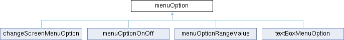

# menuOption Class Reference {#_classmenu_option}

menuOption

`#include <menu.h>`

Inheritance diagram for menuOption:

{width="50%"}

## Public Member Functions {.unnumbered}

-   [menuOption](#_classmenu_option_1a39a33397bfc7e6f57bdf3e2ccf8eb21c)
    ()

-   [menuOption](#_classmenu_option_1af1f55f3fdf6764f94f7d5dd59e149d6a)
    (const char
    \*[text](#_classmenu_option_1afbd3fb2a0fdb65669ec90f3fecf47623))

-   virtual void
    [run](#_classmenu_option_1a685680a783d26033f6e8cdb6eeab3a99) ()

-   virtual bool
    [refresh](#_classmenu_option_1acffe6e9fa34a5dc7b77f21d03dd2e446) ()

-   virtual bool
    [pushRt](#_classmenu_option_1aeeb4a10bb097059ec82d128beabd8bf1) ()

-   virtual bool
    [pushLt](#_classmenu_option_1ab500086963932ceb473f1ed45ea7d0b4) ()

## Public Attributes {.unnumbered}

-   char [text](#_classmenu_option_1afbd3fb2a0fdb65669ec90f3fecf47623)
    \[menuTextArrayLength\]

-   bool
    [autoRefresh](#_classmenu_option_1a610ed80a3027cac149f9da18ba53a82f)
    = true

## Detailed Description

Simplest [menuOption](#_classmenu_option) base class, is to be
inherited, put your custom code at
[run()](#_classmenu_option_1a685680a783d26033f6e8cdb6eeab3a99)

## Constructor & Destructor Documentation

### menuOption()`[1/2]`

menuOption

menuOption

menuOption

menuOption

`menuOption::menuOption ( )`

for compiler puposes, better not to use it

### menuOption()`[2/2]`

menuOption

menuOption

menuOption

menuOption

`menuOption::menuOption (const char * text)`

constructor, sets the caption text

## Member Function Documentation

### pushLt()

pushLt

menuOption

menuOption

pushLt

`bool menuOption::pushLt ( )[virtual]`

called then left left is pressed

Reimplemented in
[menuOptionOnOff](#_classmenu_option_on_off_1a67c0fa0d940ad4eb83135db93f39ce76),
and
[menuOptionRangeValue](#_classmenu_option_range_value_1ad23ed5c6d63c434047168963b71494f8).

### pushRt()

pushRt

menuOption

menuOption

pushRt

`bool menuOption::pushRt ( )[virtual]`

called then right arrow is pressed

Reimplemented in
[menuOptionOnOff](#_classmenu_option_on_off_1aca382e9d72c6e16310c4edfbad47dfc9),
and
[menuOptionRangeValue](#_classmenu_option_range_value_1ab52970028a31c945f9f3bf14653fa108).

### refresh()

refresh

menuOption

menuOption

refresh

`bool menuOption::refresh ( )[virtual]`

called when autoRefresh is set here and [screenMenu](#_classscreen_menu)

Reimplemented in
[changeScreenMenuOption](#_classchange_screen_menu_option_1ac3f7c0cc125172f8cd3ec286639ba4d4),
[menuOptionOnOff](#_classmenu_option_on_off_1a89f9a031515fbdf8f2b1dd6d8e3a215f),
and
[menuOptionRangeValue](#_classmenu_option_range_value_1a5363bd101b86354fcddeeb553d3e95e5).

### run()

run

menuOption

menuOption

run

`void menuOption::run ( )[virtual]`

inherit to do your thing

Reimplemented in
[changeScreenMenuOption](#_classchange_screen_menu_option_1a83972fdbfcda7b9f6cc9ae8eb9feb580),
and
[textBoxMenuOption](#_classtext_box_menu_option_1a32b4c4a87c0c9afe6633c48de869c7e4).

## Member Data Documentation

### autoRefresh

autoRefresh

menuOption

menuOption

autoRefresh

`bool menuOption::autoRefresh = true`

wants [refresh()](#_classmenu_option_1acffe6e9fa34a5dc7b77f21d03dd2e446)
to be called

### text

text

menuOption

menuOption

text

`char menuOption::text[menuTextArrayLength]`

Caption

The documentation for this class was generated from the following files:

menu.h

menu.cpp
