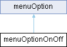

# menuOptionOnOff Class Reference {#_classmenu_option_on_off}

menuOptionOnOff

`#include <menu.h>`

Inheritance diagram for menuOptionOnOff:

{width="50%"}

## Public Member Functions {.unnumbered}

-   [menuOptionOnOff](#_classmenu_option_on_off_1adf4d6bdacf260b366cf6045d60284b7e)
    ()

-   [menuOptionOnOff](#_classmenu_option_on_off_1ac6eeab4b2b3bd8150614f1123270402c)
    (const char
    \*[text](#_classmenu_option_1afbd3fb2a0fdb65669ec90f3fecf47623),
    bool initValue=false)

    [menuOptionOnOff](#_classmenu_option_on_off) constructor

-   virtual bool
    [refresh](#_classmenu_option_on_off_1a89f9a031515fbdf8f2b1dd6d8e3a215f)
    () override

-   virtual bool
    [pushRt](#_classmenu_option_on_off_1aca382e9d72c6e16310c4edfbad47dfc9)
    () override

-   virtual bool
    [pushLt](#_classmenu_option_on_off_1a67c0fa0d940ad4eb83135db93f39ce76)
    () override

Public Member Functions inherited from

menuOption

-   [menuOption](#_classmenu_option_1a39a33397bfc7e6f57bdf3e2ccf8eb21c)
    ()

-   [menuOption](#_classmenu_option_1af1f55f3fdf6764f94f7d5dd59e149d6a)
    (const char
    \*[text](#_classmenu_option_1afbd3fb2a0fdb65669ec90f3fecf47623))

-   virtual void
    [run](#_classmenu_option_1a685680a783d26033f6e8cdb6eeab3a99) ()

## Public Attributes {.unnumbered}

-   []{#_classmenu_option_on_off_1a64e9dbc45a9b3dba01a0047b75c110f3}bool
    **state**

-   []{#_classmenu_option_on_off_1aa7eaba9c65a236748ed28083d83b224a}bool
    **statePrinted**

Public Attributes inherited from

menuOption

-   char [text](#_classmenu_option_1afbd3fb2a0fdb65669ec90f3fecf47623)
    \[menuTextArrayLength\]

-   bool
    [autoRefresh](#_classmenu_option_1a610ed80a3027cac149f9da18ba53a82f)
    = true

## Detailed Description

Switch [menuOptionOnOff](#_classmenu_option_on_off) base class is to be
inherited, put your custom code at
[run()](#_classmenu_option_1a685680a783d26033f6e8cdb6eeab3a99), read
state at state Uses \':\'([menu.cpp](#_menu_8cpp) menuOptionDelimiter)
as separator

## Constructor & Destructor Documentation

### menuOptionOnOff()`[1/2]`

menuOptionOnOff

menuOptionOnOff

menuOptionOnOff

menuOptionOnOff

`menuOptionOnOff::menuOptionOnOff ( )`

for compiler puposes, better not to use it

### menuOptionOnOff()`[2/2]`

menuOptionOnOff

menuOptionOnOff

menuOptionOnOff

menuOptionOnOff

`menuOptionOnOff::menuOptionOnOff (const char * text, bool initValue = false )`

[menuOptionOnOff](#_classmenu_option_on_off) constructor

constructor, sets the caption text, do not use \':\', might set init
value

might set initial values

::: formalpara-title
**Parameters**
:::

+-----------+-----------+-----------------------------------------------+
| in        | [text](   | string char \* used as caoption               |
|           | #_classme |                                               |
|           | nu_option |                                               |
|           | _1afbd3fb |                                               |
|           | 2a0fdb656 |                                               |
|           | 69ec90f3f |                                               |
|           | ecf47623) |                                               |
+-----------+-----------+-----------------------------------------------+
| in        | initValue | optional initial value                        |
+-----------+-----------+-----------------------------------------------+

## Member Function Documentation

### pushLt()

pushLt

menuOptionOnOff

menuOptionOnOff

pushLt

`bool menuOptionOnOff::pushLt ( )[override], [virtual]`

switches state, if inherit, call base
[menuOptionOnOff::pushLt()](#_classmenu_option_on_off_1a67c0fa0d940ad4eb83135db93f39ce76)

Reimplemented from
[menuOption](#_classmenu_option_1ab500086963932ceb473f1ed45ea7d0b4).

### pushRt()

pushRt

menuOptionOnOff

menuOptionOnOff

pushRt

`bool menuOptionOnOff::pushRt ( )[override], [virtual]`

switches state, if inherit, call base
[menuOptionOnOff::pushRt()](#_classmenu_option_on_off_1aca382e9d72c6e16310c4edfbad47dfc9)

Reimplemented from
[menuOption](#_classmenu_option_1aeeb4a10bb097059ec82d128beabd8bf1).

### refresh()

refresh

menuOptionOnOff

menuOptionOnOff

refresh

`bool menuOptionOnOff::refresh ( )[override], [virtual]`

inherit to do your thing

Reimplemented from
[menuOption](#_classmenu_option_1acffe6e9fa34a5dc7b77f21d03dd2e446).

The documentation for this class was generated from the following files:

menu.h

menu.cpp
