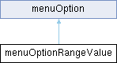

# menuOptionRangeValue Class Reference {#_classmenu_option_range_value}

menuOptionRangeValue

`#include <menu.h>`

Inheritance diagram for menuOptionRangeValue:

{width="50%"}

## Public Member Functions {.unnumbered}

-   [menuOptionRangeValue](#_classmenu_option_range_value_1a00645224c41934e05bf0aa4a3fe759bb)
    ()

-   [menuOptionRangeValue](#_classmenu_option_range_value_1a3dd58f7e970f86dd8956581258262b70)
    (const char
    \*[text](#_classmenu_option_1afbd3fb2a0fdb65669ec90f3fecf47623), int
    minVal, int maxVal, int initValue, int step=1)

-   virtual bool
    [refresh](#_classmenu_option_range_value_1a5363bd101b86354fcddeeb553d3e95e5)
    () override

-   virtual bool
    [pushRt](#_classmenu_option_range_value_1ab52970028a31c945f9f3bf14653fa108)
    () override

-   virtual bool
    [pushLt](#_classmenu_option_range_value_1ad23ed5c6d63c434047168963b71494f8)
    () override

Public Member Functions inherited from

menuOption

-   [menuOption](#_classmenu_option_1a39a33397bfc7e6f57bdf3e2ccf8eb21c)
    ()

-   [menuOption](#_classmenu_option_1af1f55f3fdf6764f94f7d5dd59e149d6a)
    (const char
    \*[text](#_classmenu_option_1afbd3fb2a0fdb65669ec90f3fecf47623))

-   virtual void
    [run](#_classmenu_option_1a685680a783d26033f6e8cdb6eeab3a99) ()

## Public Attributes {.unnumbered}

-   []{#_classmenu_option_range_value_1ab75358bfdf15fb6aeb775b4869912b6d}int
    **state**

-   []{#_classmenu_option_range_value_1a06c7316fec0f802fc2801082ab308e9d}int
    **statePrinted**

-   []{#_classmenu_option_range_value_1a7d70d4d8c6157af0a42e6e8fb300946b}int
    **\_maxValue**

-   []{#_classmenu_option_range_value_1afcb2cfe1f85eb41f0376f59489aeb555}int
    **\_minValue**

-   []{#_classmenu_option_range_value_1a78f62703c9614b523f1152e1e56c23a4}int
    **\_step**

Public Attributes inherited from

menuOption

-   char [text](#_classmenu_option_1afbd3fb2a0fdb65669ec90f3fecf47623)
    \[menuTextArrayLength\]

-   bool
    [autoRefresh](#_classmenu_option_1a610ed80a3027cac149f9da18ba53a82f)
    = true

## Detailed Description

Linear value selector
[menuOptionRangeValue](#_classmenu_option_range_value) base class is to
be inherited, put your custom code at
[run()](#_classmenu_option_1a685680a783d26033f6e8cdb6eeab3a99), read
state at state Uses \':\' as separator

## Constructor & Destructor Documentation

### menuOptionRangeValue()`[1/2]`

menuOptionRangeValue

menuOptionRangeValue

menuOptionRangeValue

menuOptionRangeValue

`menuOptionRangeValue::menuOptionRangeValue ( )`

for compiler puposes, better not to use it

### menuOptionRangeValue()`[2/2]`

menuOptionRangeValue

menuOptionRangeValue

menuOptionRangeValue

menuOptionRangeValue

`menuOptionRangeValue::menuOptionRangeValue (const char * text, int minVal, int maxVal, int initValue, int step = 1 )`

constructor, sets the caption text, do not use \':\', maximum, minimum,
initial value, might set step

## Member Function Documentation

### pushLt()

pushLt

menuOptionRangeValue

menuOptionRangeValue

pushLt

`bool menuOptionRangeValue::pushLt ( )[override], [virtual]`

decreases state by 1 step(see constructor), if inherit, call base
[menuOptionRangeValue::pushRt()](#_classmenu_option_range_value_1ab52970028a31c945f9f3bf14653fa108)

Reimplemented from
[menuOption](#_classmenu_option_1ab500086963932ceb473f1ed45ea7d0b4).

### pushRt()

pushRt

menuOptionRangeValue

menuOptionRangeValue

pushRt

`bool menuOptionRangeValue::pushRt ( )[override], [virtual]`

increases state by 1 step(see constructor), if inherit, call base
[menuOptionRangeValue::pushRt()](#_classmenu_option_range_value_1ab52970028a31c945f9f3bf14653fa108)

Reimplemented from
[menuOption](#_classmenu_option_1aeeb4a10bb097059ec82d128beabd8bf1).

### refresh()

refresh

menuOptionRangeValue

menuOptionRangeValue

refresh

`bool menuOptionRangeValue::refresh ( )[override], [virtual]`

inherit to do your thing

Reimplemented from
[menuOption](#_classmenu_option_1acffe6e9fa34a5dc7b77f21d03dd2e446).

The documentation for this class was generated from the following files:

menu.h

menu.cpp
