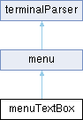

# menuTextBox Class Reference {#_classmenu_text_box}

menuTextBox

Inheritance diagram for menuTextBox:

{width="50%"}

## Public Member Functions {.unnumbered}

-   void
    [msgTxtInputMultiline](#_classmenu_text_box_1af3d23ddd2e543da36c43e05246dc8ebc)
    (char \*result, unsigned int maxLength, unsigned int minLength=0,
    const char \*allowedChars=nullptr)

    if cancel exits with editing=true

Public Member Functions inherited from

menu

-   [menu](#_classmenu_1ad345b60b72c4992525cf064d5642c1d9) ()

-   virtual void [init](#_classmenu_1aeef76dfa13483e5ad3834befee1a9b1e)
    (Stream \*userSerialTerminal) override

-   void [addscreen](#_classmenu_1a70e706129d30d2cab9f2c1ca145b8911)
    ([screenMenu](#_classscreen_menu) \*pantalla)

-   void [run](#_classmenu_1a5c752d626f8bd8e3ff69ec04b18fc1b1) ()

    Parses the userTty, check user interaction or display query.

-   bool [msgTxtInput](#_classmenu_1a37db65afc7cb697e85eb3e78e2c94367)
    (const char \*prompt, char \*result, unsigned int maxLength,
    unsigned int minLength=0)

-   void [msgSmallWait](#_classmenu_1a6d1b2c9042ea98d42859208ad20312ed)
    (const char \*prompt)

-   void [msgPause](#_classmenu_1aef231381a7322e8822ef9e7ebdbc26a0)
    (const char \*prompt)

-   bool [msgYes](#_classmenu_1a9b0ba44cd5add79dd4a521886fe61e03) (const
    char \*prompt)

-   void [msgPause](#_classmenu_1aa1d6e3892e78989e60b7d62bb600a4c0) ()

-   void
    [setPrettyDotLeadersMargin](#_classmenu_1a745a30a0f44073a03e8c9d5bf02892c8)
    (int bothTextsLength)

-   void **printLnCentered** (const char \*text)

-   void **printLnCentered** (const String &text)

-   void **printLnCentered** ()

-   void **printLnCentered** (char c)

-   void **printLnCentered** (unsigned char b, int base=DEC)

-   void **printLnCentered** (int num, int base=DEC)

-   void **printLnCentered** (unsigned int num, int base=DEC)

-   void **printLnCentered** (long num, int base=DEC)

-   void **printLnCentered** (unsigned long num, int base=DEC)

-   void **printLnCentered** (long long num, int base=DEC)

-   void **printLnCentered** (unsigned long long num, int base=DEC)

-   void **printLnCentered** (double num, int digits=2)

-   unsigned int **printDotLeaders** (const char \*left, const char
    \*right, int margin=-1, int minDots=-1)

-   void [setscreen](#_classmenu_1a8d2562e25294e0610bdac5aa78846b43)
    (int targetScreenMenu, bool setWhereICame=true)

-   void [refresh](#_classmenu_1a4e9b098475d7d5b723eca934105540f0) ()

-   void [doBack](#_classmenu_1aefe2d8a405d258c73361b32ccaf79960) ()

-   void [show](#_classmenu_1aae1769c812999eba1699adcf91481a06) ()

Public Member Functions inherited from

terminalParser

-   virtual void
    [doClearScreen](#_classterminal_parser_1a0a29fe6e7213859c8a02848b71d26756)
    ()

-   virtual void
    [doMoveCursor](#_classterminal_parser_1a923c3123f8919bed1f3cb2fa2476910b)
    (int line, int column)

-   virtual void
    [doCUU](#_classterminal_parser_1a8f57fd40d9de232c7268e9b7ee847fcd)
    (unsigned int amount=1)

-   virtual void
    [doCUD](#_classterminal_parser_1ae93279b1f2936775782c8a57b9536ac6)
    (unsigned int amount=1)

-   virtual void
    [doCUF](#_classterminal_parser_1ad8656daf1752076a5a1dac3f4d494fd4)
    (unsigned int amount=1)

-   virtual void
    [doCUB](#_classterminal_parser_1a1a6beae57840957a5562dde17a20a724)
    (unsigned int amount=1)

-   virtual void
    [doEL](#_classterminal_parser_1a36ccc931b80ea01156fb211b948175a9)
    (bool wholeLine=true)

-   virtual void
    [doHideCursor](#_classterminal_parser_1a75a5ceb44572f74422dfd266315fa817)
    (bool hide=true)

-   void
    [invertColors](#_classterminal_parser_1a1aadbea2a1ca57bb17df0f606c4e3d38)
    (char \*entrada, unsigned int allargadaMax)

-   void
    [invertColors](#_classterminal_parser_1ab349d035ca25bcb7ebe908e3c672be9f)
    (String \*cadena)

-   bool
    [doGuess](#_classterminal_parser_1a23fc5e4c509e9b478917501a681abaa2)
    (char caracter)

-   virtual void
    [tab](#_classterminal_parser_1a06965ffbf30e9cb90388cf5be46a3f18) ()

-   virtual void
    [beep](#_classterminal_parser_1ae66b2b892812a8baf74c04f1f4c0d29a) ()

-   virtual void **insert** (bool setDisplayInsert=false)

-   virtual void
    [avPg](#_classterminal_parser_1a9f5eafd4aa4534edd3cd6f5fd44ef0e9) ()

-   virtual void
    [rePg](#_classterminal_parser_1aa45d521a6cab097e88e8233eca680979) ()

-   virtual void
    [cHA](#_classterminal_parser_1a3c0ecda7f7800f0e03cdcde971c24061)
    (unsigned int argc, int \*argv)

-   virtual void **eL** (unsigned int argc, int \*argv)

-   virtual void
    [sGR](#_classterminal_parser_1a397862cda3885c4d4799f2bec30571f7)
    (unsigned int argc, int \*argv)

-   virtual void
    [dSR](#_classterminal_parser_1a4c338824f4aed97156bad3c61dec3180)
    (unsigned int argc, int \*argv)

-   virtual void
    [rM](#_classterminal_parser_1a8dd7048a799c0ff650f9a5ded8d69875)
    (unsigned int argc, int \*argv)

-   virtual void
    [sM](#_classterminal_parser_1a5a06355cba46c2659407e877605a302a)
    (unsigned int argc, int \*argv)

-   virtual void
    [dA](#_classterminal_parser_1ad5b372fe68d713d0be661b97b59497f9)
    (unsigned int argc, int \*argv)

-   virtual void
    [cUP](#_classterminal_parser_1ad789769a2e775aab32d432add0ea46a3)
    (unsigned int argc, int \*argv)

-   virtual void
    [eD](#_classterminal_parser_1ada1592d74dfd5e72606123fa80f45cec)
    (unsigned int argc, int \*argv)

-   virtual void
    [vPA](#_classterminal_parser_1a296d184e9c57722f2ed0e4c1ec2f51ee)
    (unsigned int argc, int \*argv)

-   virtual void
    [dCH](#_classterminal_parser_1a91e94bc068388e9ac1631bbbb81a1274)
    (unsigned int argc, int \*argv)

## Public Attributes {.unnumbered}

-   uint16_t
    [textLineWidth](#_classmenu_text_box_1ae4e9ac624cc03ebfdd94368ab7f88297)
    = defaultTextBoxWidth

-   []{#_classmenu_text_box_1a5efaf6b42941cfe1151eee3c68a2569b}uint8_t
    **lastTextBoxExitCode** =0

-   []{#_classmenu_text_box_1a2b87af19357f208143b4b0bff63411c7}textBoxStatus
    **\_textBoxStatus** = textBoxStatus::noExit

-   []{#_classmenu_text_box_1acebbe8d276626cb5233195b2fade1350}[textBoxMenuOption](#_classtext_box_menu_option)
    \* **\_textBoxCallBack** = nullptr

Public Attributes inherited from

menu

-   uint8_t **\_topPadding** = 1

-   bool
    [askTerminalSize](#_classmenu_1a6ad9b94a26de95af0654c30fbe288023) =
    true

-   bool
    [verticallyCenter](#_classmenu_1a7445256b6a139888c7a40324222f8a1b) =
    false

-   bool
    [horizontallyCenter](#_classmenu_1a58b8fde6110d6977c20942473d95ab58)
    = true

-   unsigned int **terminalRowsCols** \[2\] = {0, 0}

-   uint8_t
    [terminalSizeQueries](#_classmenu_1ae98d8f9d0acf83c7a3da3ef122130775)
    = 0

-   int
    [activeScreenMenu](#_classmenu_1a85f384d5548453ee9bca984199d1f65b) =
    -1

-   int
    [totalScreenMenus](#_classmenu_1ae0b012e3923d083b152f26a806dd1954) =
    0

-   unsigned int
    [screenMenuOptions](#_classmenu_1a5bdd3be3af51b84e1f48bfaf63a47030)
    = displayMenuOptionsDefault

-   [screenMenu](#_classscreen_menu) \*
    [pantalles](#_classmenu_1ad44abe1e9b8eb92c8650fa2555ed1719)
    \[screenMenuMax\]

-   uint8_t **dotLeadersMargin** = 2

-   uint8_t **dotLeadersMinDots** = 2

-   char **dotLeadersChar** = \'.\'

-   unsigned int **dotLeadersDefaultWidth** = menuTextArrayLength

Public Attributes inherited from

terminalParser

-   bool **insertStatus**

-   Stream \*
    [userTty](#_classterminal_parser_1a2a6130e1a9850a90aebcd6a72c297f6a)

## Static Public Attributes {.unnumbered}

-   static const char \*
    [exitCodeDescription](#_classmenu_text_box_1a47f9a7822261789cab98937810916361)
    \[\]

## Additional Inherited Members {.unnumbered}

Protected Member Functions inherited from

menu

-   void [show](#_classmenu_1a2446ad69c4c477e504057eb973d970c6)
    (unsigned int index)

-   virtual void [cPR](#_classmenu_1ad3cf38c2f89f949f086be41dcb18f0fb)
    (unsigned int argc, int \*argv) override

-   void **queryTerminalSize** (bool wait4Response=true)

Protected Attributes inherited from

menu

-   unsigned int
    [selectedMenuOption](#_classmenu_1a86a4b29a9344918183d9bca19fced1fb)

-   unsigned long
    [nextRefresh](#_classmenu_1ad5c3afc956e40fceec51f84076d587a5) = 0

-   bool [runningOption](#_classmenu_1a6bfb8b09beaf20e61fa49b5354814ba0)
    = false

-   unsigned int
    [contentOriginRow](#_classmenu_1a4cf8c7333e2a4506b6c26a44afffe5d7) =
    1

-   unsigned int
    [contentOriginCol](#_classmenu_1aa5e62c03f5b6d7fa7a476242fa401640) =
    1

-   char [lastInputChar](#_classmenu_1ad8f94037dda569600452a261962ea75a)

-   unsigned long
    [nextEscBack](#_classmenu_1aa75acd07479fe52843238bb4bbdb740d) = 0

Static Protected Attributes inherited from

menu

-   static constexpr char **frameChars** \[3\] = {\'-\',\'\|\',\'+\'}

## Member Function Documentation

### msgTxtInputMultiline()

msgTxtInputMultiline

menuTextBox

menuTextBox

msgTxtInputMultiline

`void menuTextBox::msgTxtInputMultiline (char * result, unsigned int maxLength, unsigned int minLength = 0 , const char * allowedChars = nullptr )`

if cancel exits with editing=true

::: formalpara-title
**Parameters**
:::

+-------------+--------------------------------------------------------+
| resultat    | textbuffer where content is passed and returned        |
+-------------+--------------------------------------------------------+
| a           | size-1 of what is desired in char\* resultat           |
| llargadaMax |                                                        |
+-------------+--------------------------------------------------------+
| a           | minimum text desired, can be 1                         |
| llargadaMin |                                                        |
+-------------+--------------------------------------------------------+
| caract      | array of characters(char==byte==uint8_t) that the text |
| ersPermesos | must be able to contain                                |
+-------------+--------------------------------------------------------+

::: formalpara-title
**Returns**
:::

textbuffer resultat is filled and usable

## Member Data Documentation

### exitCodeDescription

exitCodeDescription

menuTextBox

menuTextBox

exitCodeDescription

`const char * menuTextBox::exitCodeDescription[static]`

Initial value:

                                                = {
        "exit by enter",
        "exit by esc",
        "software aborted",
        "not null terminated",
        "text line width too short",
        "text too short",
        "corrupt string",
        "text too long",
        "area 2 tall 4 screen, wide it",
        "area 2 wide 4 screen, tall it"
    }

### textLineWidth

textLineWidth

menuTextBox

menuTextBox

textLineWidth

`uint16_t menuTextBox::textLineWidth = defaultTextBoxWidth`

for textBox editor width

The documentation for this class was generated from the following files:

menu.h

menu.cpp
