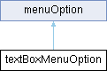

# textBoxMenuOption Class Reference {#_classtext_box_menu_option}

textBoxMenuOption

Inheritance diagram for textBoxMenuOption:

{width="50%"}

## Public Member Functions {.unnumbered}

-   []{#_classtext_box_menu_option_1a2b5bdf00b572662c1349d08bdb9ad17d}**textBoxMenuOption**
    (const char
    \*[text](#_classmenu_option_1afbd3fb2a0fdb65669ec90f3fecf47623))

-   virtual void
    [run](#_classtext_box_menu_option_1a32b4c4a87c0c9afe6633c48de869c7e4)
    () override

-   virtual bool
    [checkBackgroundEvents](#_classtext_box_menu_option_1a7e479ad0b161183d23db2ac5c682c710)
    ()

-   virtual bool
    [performUserInteraction](#_classtext_box_menu_option_1a9b54cfa952178e1a658b39bd0c14386f)
    ()

Public Member Functions inherited from

menuOption

-   [menuOption](#_classmenu_option_1a39a33397bfc7e6f57bdf3e2ccf8eb21c)
    ()

-   [menuOption](#_classmenu_option_1af1f55f3fdf6764f94f7d5dd59e149d6a)
    (const char
    \*[text](#_classmenu_option_1afbd3fb2a0fdb65669ec90f3fecf47623))

-   virtual bool
    [refresh](#_classmenu_option_1acffe6e9fa34a5dc7b77f21d03dd2e446) ()

-   virtual bool
    [pushRt](#_classmenu_option_1aeeb4a10bb097059ec82d128beabd8bf1) ()

-   virtual bool
    [pushLt](#_classmenu_option_1ab500086963932ceb473f1ed45ea7d0b4) ()

## Public Attributes {.unnumbered}

-   []{#_classtext_box_menu_option_1a56da6e43a7f227f20c46d5fa4edae235}String
    **caption**

Public Attributes inherited from

menuOption

-   char [text](#_classmenu_option_1afbd3fb2a0fdb65669ec90f3fecf47623)
    \[menuTextArrayLength\]

-   bool
    [autoRefresh](#_classmenu_option_1a610ed80a3027cac149f9da18ba53a82f)
    = true

## Member Function Documentation

### checkBackgroundEvents()

checkBackgroundEvents

textBoxMenuOption

textBoxMenuOption

checkBackgroundEvents

`bool textBoxMenuOption::checkBackgroundEvents ( )[virtual]`

doEvents, textbox still on display, do not use it

::: formalpara-title
**Returns**
:::

wether display is needed

### performUserInteraction()

performUserInteraction

textBoxMenuOption

textBoxMenuOption

performUserInteraction

`bool textBoxMenuOption::performUserInteraction ( )[virtual]`

textBox still active, but not on display, may perform display user
interaction

::: formalpara-title
**Returns**
:::

wether textBox editing shall be cancelled

### run()

run

textBoxMenuOption

textBoxMenuOption

run

`void textBoxMenuOption::run ( )[override], [virtual]`

inherit to do your thing

Reimplemented from
[menuOption](#_classmenu_option_1a685680a783d26033f6e8cdb6eeab3a99).

The documentation for this class was generated from the following files:

menu.h

menu.cpp
